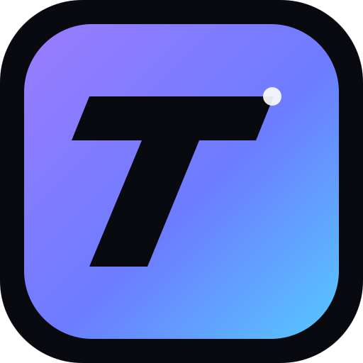

# VISTA

<p align="center">
  
</p>

<h1 align="center">VISTA</h1>

<p align="center"><strong>A clean, Chromium-powered desktop browser by Mythical Studios.</strong></p>

<p align="center">
  <a href="https://github.com/Vexedhere/vista/releases/latest">Download</a>
  ·
  <a href="https://github.com/Vexedhere/vista/releases">Releases</a>
  ·
  <a href="https://github.com/Vexedhere/vista/issues">Issues</a>
</p>

---

## ✦ What is VISTA?

VISTA is a **real standalone Windows browser**. It is not a website pretending to be a browser.

The app runs locally as a desktop application using **Electron + Chromium**, with its own browser window, tabs, navigation controls and address/search bar.

### Built for
- ⚡ Fast everyday browsing
- 🗂️ Real multi-tab browsing
- 🔎 Search or enter any web address
- ↩️ Back, forward, reload and home controls
- 🪟 Native Windows application experience
- 🧩 A simple foundation for future browser features

## ↓ Download VISTA

**Windows 10/11 · 64-bit**

### [Download the latest VISTA release](https://github.com/Vexedhere/vista/releases/latest)

Download the installer from **GitHub Releases**. You do not need to use Netlify or a separate website to get the browser.

> VISTA is currently in early preview. Releases may change as the project develops.

## ✦ VISTA branding

**VISTA** is the browser brand.  
**Mythical Studios** is the studio behind it.

> **VISTA — See the web differently.**

## 🛠️ Development

Requirements:
- Node.js 22+
- Windows for building the Windows installer

Install dependencies:

```bash
npm install
```

Run VISTA locally:

```bash
npm start
```

Build the Windows installer:

```bash
npm run dist
```

The installer is generated in `dist/`.

## 🚀 Releases

Pushing a version tag such as `v0.1.0` starts the GitHub Actions Windows build. The workflow packages VISTA into a Windows installer and attaches it to the GitHub Release.

## 🗺️ Roadmap

- [x] Standalone Chromium browser
- [x] Real multi-tab UI
- [x] Address/search bar
- [x] Back / forward / reload
- [x] GitHub-based distribution
- [x] Automated Windows builds
- [ ] Bookmarks
- [ ] History
- [ ] Downloads manager
- [ ] Settings
- [ ] Auto-updates
- [ ] Signed releases
- [ ] macOS build
- [ ] Linux build

## 📜 License

MIT © 2026 Vexedhere / Mythical Studios
